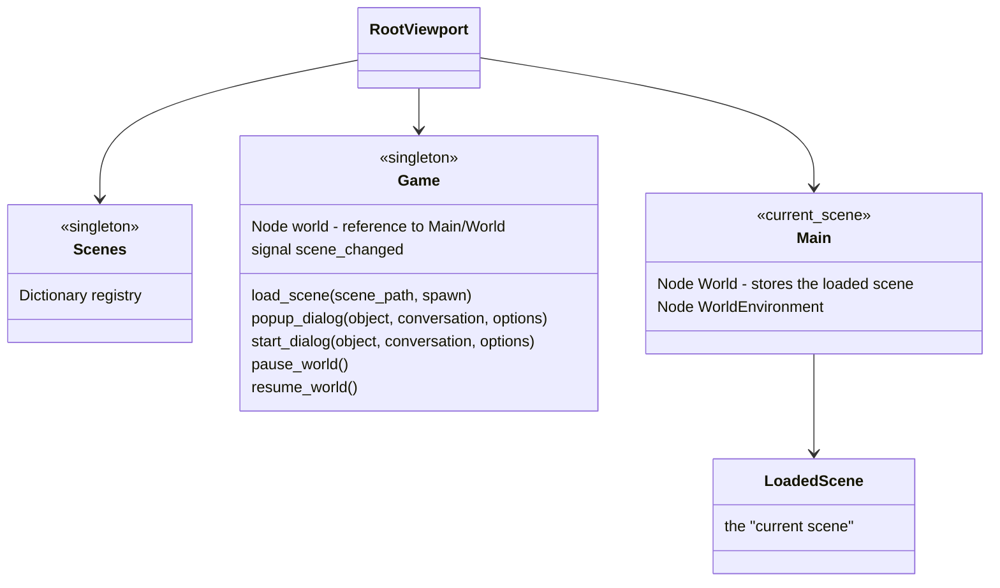
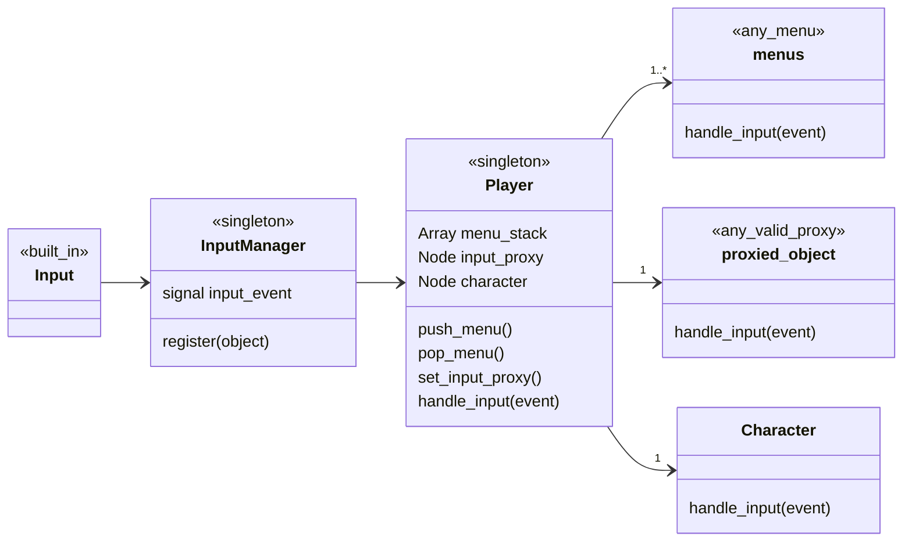
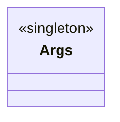
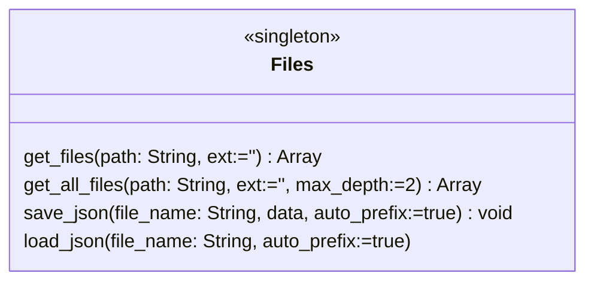
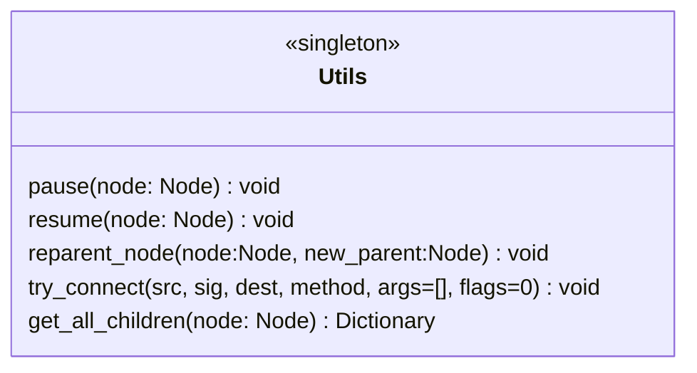

# gdstrap

## Top level
The Makefile is use for automating various tasks. In this empty project, it only really has helpers for running the build steps on a remote server for creating an HTML5 export.

The Godot project is in a subfolder to allow placing assets or other tools inside this repository but guarantee that Godot can't see them and try to import them or include them in a build.

# Godot project folder

Todo: overview of project structure

Notable files:

- `Main.tscn`: the designated "current_scene", should never be removed
- `global_canvas/GlobalCanvas.tscn`: holds the global DialogBox and any created PopupDialogs
- `menus/MainMenu.tscn`: game boots to this by default
- `menus/PauseMenu.tscn`: menu that's opened by hitting ESC, pauses game when open
- `player/Player.tscn`: represents the player, routes player's inputs to correct objects
- `system/Game.gd`: Game Manager class
- `isometric/*`: scenes and tools for an isometric game
- `topdown/*`:  scenes and tools for a topdown game
- `sidescroller/*`:  scenes and tools for a sidescroller game

# Main Systems

- Scene Management
  - Spawn points
- Input Management
- Character Controller
  - Interaction System
- Other Utilities

# Scene Management

This is designed to always have `Main.tscn` be the "current scene". Use `Game.load_scene()` to change scenes (`get_tree().set_current_scene()` should not be used).

You can launch a scene directly using F6, and the scene management system will automatically load `Main.tscn`, set it as the "current scene", and add the loaded scene as a child of `Main`.

`Game.load_scene()` can accept either a full path to a scene (`res://path/to/file.tscn`), or a scene nickname as defined in `system/Scenes.gd`.

## Spawn Points

`Game.load_scene()`'s second argument is the name of the spawn point you would like the player to start at. Character spawning is not handled by the scene management system, so this function will not attempt to validate spawn point names.

Any scene that wants to support spawn points needs to have a child node named `Spawns`, which must have at least one child named `Default`. If no spawn point is specified, `Default` will be chosen. Additional spawn points can have any name except `Dev`, which is reserved for a special development spawn point, which be selected if the scene is launched directly using F6.

# Input Management

Godot makes it easy for any Node to override `_input` and capture user input events. Unfortunately, this also makes it easy to create a spaghetti mess of state management, where every Node that uses `_input` needs to know about the entire structure of the game.

`InputManager` was designed to simplify event serialization for multiplayer, but using it results in a simpler, decoupled architecture. The `Player` singleton is responsible for knowing about the game structure and routing events to the correct destination. Game objects like menus or the player character never need to know about the state of other objects: if the object recieves events via `handle_input()`, then it must be okay to act on those events.

`Player` maintains a stack of active menus, and will route events to whatever is on top of the `menu_stack`. Menus should call `Player.push_menu(self)` when they open, and `Player.pop_menu()` when they close.

If the `menu_stack` is empty, events will be routed to `input_proxy`.

If the `menu_stack` and `input_proxy` are empty, events will be routed to the active character, if there is one.

# Other Utilities

## Args

This class parses any command-line arguments given to the game

## Files

`get_files` returns an array containing the names of all files in the given directory that end with `ext`
`get_all_files` recursive version of `get_files`, with configurable depth

`save_json` and `load_json` will automatically prefix the given file name with `res://data/` when run from the editor, or `user://` if running from an exported build. This makes local debugging of saved settings or gamedata easier.

## Utils

`Utils` contains various helper functions, mostly related to node manipulation.

`pause` and `resume` will walk the entire subtree of the given node, and forcibly pause or unpause the node and all of its children. This is much easier to use than the normal Godot method of pausing the entire scene tree but specifically excepting certain nodes.

`reparent_node` safely removes a node from its existing parent, if it has one, and then adds it to the new parent

`try_connect` safely attempts to connect a signal

`get_all_children` recursively finds all children of the specified node, and returns the results in a flat dictionary of form `Nodepath: Node`.
